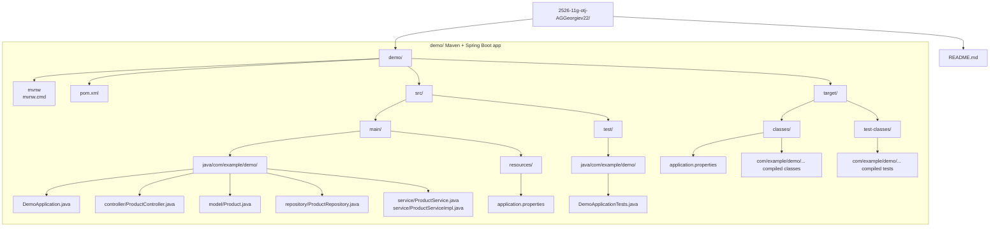

# File Architecture

This diagram reflects the current file and folder structure of the workspace and the `demo` application module.

## Notes

- `src/main` holds the application source code and runtime resources.
- `src/test` holds test sources.
- `target` contains generated build artifacts from Maven and should be treated as output, not source.