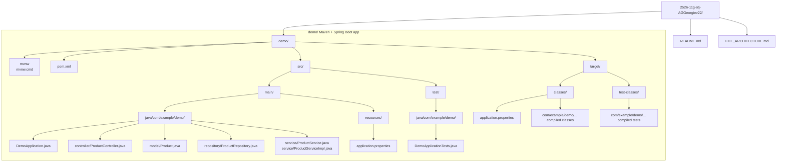

# 2526-11g-otj-AGGeorgiev22

This repository contains a single Spring Boot Maven application in the `demo/` folder. The project already has the standard package layout for a product-based CRUD app, with domain, repository, and service layers in place.

## Overview

The application currently includes:

- a Spring Boot entry point
- a `Product` JPA entity
- a `ProductRepository` based on Spring Data JPA
- a `ProductService` interface and service implementation
- a test class for basic Spring context loading

The controller file exists, but it is currently empty, so the REST API surface is not implemented yet.

## Tech Stack

- Java 17 JDK
- Spring Boot 4.0.3
- Spring Web
- Spring Data JPA
- Maven Wrapper

## Current File Architecture



## Source Layout

- `demo/src/main/java/com/example/demo` contains the application source code.
- `demo/src/main/resources` contains runtime configuration.
- `demo/src/test/java/com/example/demo` contains tests.
- `demo/target` contains generated Maven build output.

## Current Status

The repository is structured like a layered Spring Boot application, but it is not yet a complete end-to-end CRUD app.

- `ProductController.java` exists but does not currently define endpoints.
- `application.properties` only sets the application name.
- `pom.xml` includes JPA support, but the project does not currently declare a database driver.

## Working With The Project

From the `demo/` directory you can use the Maven wrapper:

```powershell
.\mvnw.cmd test
```

This requires a Java 17 JDK. A plain JRE is not enough because Maven needs the Java compiler.

If you want to run the application as a real database-backed API, the next missing pieces are:

1. add a database driver dependency
2. configure a datasource in `application.properties`
3. implement REST endpoints in `ProductController.java`
